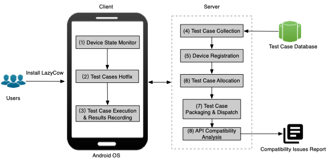

# RemoteTest
Android fragmentation refers to the overwhelming diversity of Android devices and OS versions. These lead to the
impossibility of testing an app on every supported device, leaving a number of compatibility bugs scattered in the community and
thereby resulting in poor user experiences. To mitigate this, our fellow researchers have designed various works to automatically detect
such compatibility issues. However, the current state-of-the-art tools can only be used to detect specific kinds of compatibility issues
(i.e., compatibility issues caused by API signature evolution), i.e., many other essential types of compatibility issues are still unrevealed.
For example, customized OS versions on real devices and semantic changes of OS could lead to serious compatibility issues, which
are non-trivial to be detected statically.

To this end, we propose a novel, lightweight, crowdsourced testing approach, LAZYCOW, to fill
this research gap and enable the possibility of taming Android fragmentation through crowdsourced efforts. Specifically, crowdsourced
testing is an emerging alternative to conventional mobile testing mechanisms that allow developers to test their products on real
devices to pinpoint platform-specific issues.

Our paper is under major revision at TSE.

## Approach
The main goal of our work is to provide a lightweight
crowdsourced testing platform for automatically dispatching and executing unit tests on various real-world Android
devices. To that end, we design and implement a prototype
tool called LAZYCOW for achieving this purpose. The following figure
illustrates the architecture of LAZYCOW and it works in
a client-server model. The client is installed on various
android devices and manages the execution of test cases.
Specifically, it determines the time and number of test cases
to be executed and sends the testing results back to the
server for further analysis. The server manages the collection of test cases, packaging and dispatching of test cases
to the clients, and analyzing the compatibility issues based
on the results collected from various devices. We elaborate
on the detailed process of each component in the following
subsections.

We developed a LAZYCOW client app to be installed on
Android devices. The client monitors the status of the device
to determine the suitable time (e.g., when the device is
not in use) to run the test cases. It then interacts with the
server to download and execute the test cases and return
the execution results to the server. As shown in Figure 2,
the client consists of three modules, namely (1) Device State
Monitor, (2) Test Cases Hotfix, and (3) Test Cases Execution &
Results Recording.

